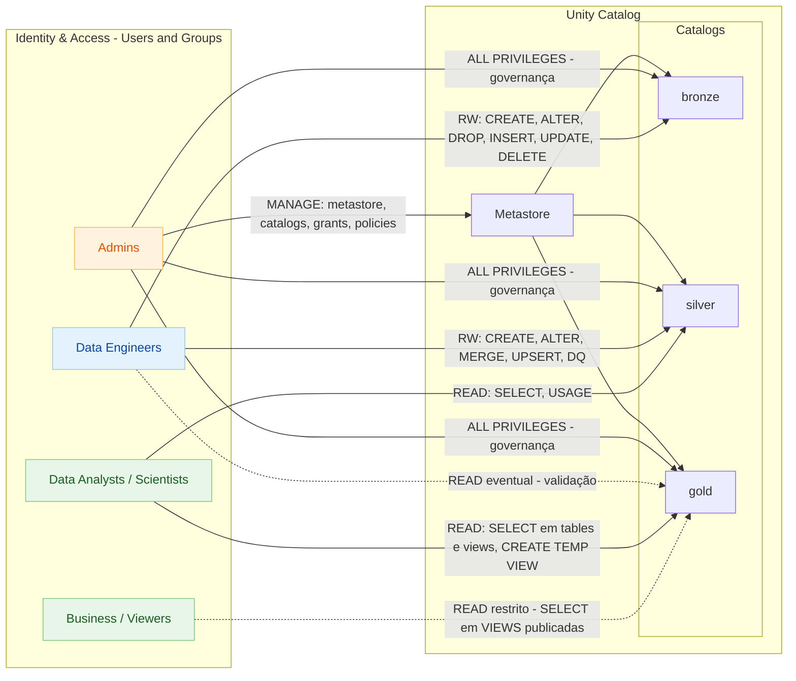

# 🏗️ Identidade e Acesso

Este diagrama mostra a arquitetura de identidade e acesso do Unity Catalog.

Antes de falar de permissões no **Unity Catalog**, é essencial entender o conceito de **acesso** dentro do Databricks — porque ele une três camadas de controle:
1️⃣ Identidade (quem é o usuário)
2️⃣ Entitlement (o que ele pode fazer na plataforma)
3️⃣ Permissões (o que ele pode acessar dentro dos catálogos, schemas e tabelas)

---

## 🧩 Identidade e Acesso no Databricks

Essa tela que você mostrou — *Identity and access* — é o centro de controle de **quem entra**, **como entra** e **o que pode fazer**.
Ela é dividida em três blocos principais:

* **Users** → usuários humanos (colaboradores, alunos, analistas)
* **Groups** → agrupamentos de usuários para aplicar regras em massa
* **Service Principals** → identidades de aplicações, scripts ou automações (sem login humano)

---

## 👥 4 Grupos Clássicos de Usuários (recomendação base)

Na maioria dos projetos de dados (inclusive na arquitetura Databricks + Unity Catalog), criamos **quatro grupos clássicos** de acesso.
Eles garantem separação de responsabilidades e segurança, e servem como *template* para novos workspaces.

---

### 1. **Admins**

* **Função:** controle total do ambiente (configura metastore, clusters, permissões e policies).
* **Permissões típicas:**

  * `USE CATALOG`, `CREATE SCHEMA`, `GRANT`, `MANAGE WORKSPACES`
  * Acesso total ao Unity Catalog e recursos de segurança
* **Quem entra:** time de engenharia de dados sênior ou DevOps responsável pela governança.
* **Comentário:** são os “guardas do portão”. Tudo passa por eles.

---

### 2. **Data Engineers**

* **Função:** construir pipelines, ingestões, transformações e tabelas bronze/silver/gold.
* **Permissões típicas:**

  * `SELECT`, `INSERT`, `UPDATE`, `CREATE TABLE` nos catálogos `bronze` e `silver`
  * `EXECUTE` em jobs e clusters
* **Quem entra:** engenheiros e desenvolvedores que codificam.
* **Comentário:** são os “construtores” do Lakehouse — lidam com ingestion e transformação, mas não necessariamente com acesso ao dado sensível.

---

### 3. **Data Analysts / Scientists**

* **Função:** explorar dados, criar queries, dashboards e modelos.
* **Permissões típicas:**

  * `SELECT` em `silver` e `gold`
  * Nenhum direito de escrita ou deleção
* **Quem entra:** analistas, cientistas e usuários de BI.
* **Comentário:** representam o “consumo” do dado. Precisam de acesso limpo e controlado.

---

### 4. **Business / Viewers**

* **Função:** apenas visualizar dashboards e relatórios publicados.
* **Permissões típicas:**

  * `SELECT` restrito ou `READ` em views específicas do `gold`
* **Quem entra:** stakeholders de negócio, gestores, parceiros externos.
* **Comentário:** quanto mais próximo do negócio, mais restrito deve ser o acesso técnico.

---

## 🧠 Conclusão

Esses quatro grupos formam uma base de governança prática:

| Grupo     | Camada de acesso   | Permissões principais         | Objetivo                  |
| --------- | ------------------ | ----------------------------- | ------------------------- |
| Admins    | Global / Metastore | Gerenciar tudo                | Governança e segurança    |
| Engineers | Bronze / Silver    | Ler, escrever e criar tabelas | Construir pipelines       |
| Analysts  | Silver / Gold      | Ler e consultar               | Explorar e gerar insights |
| Business  | Gold               | Visualizar                    | Tomada de decisão         |

---

Se quiser, posso te mostrar **como configurar esses 4 grupos diretamente no Unity Catalog**, incluindo comandos SQL (`CREATE GROUP`, `GRANT ON CATALOG`, etc.) e as boas práticas de privilégios por camada (Bronze, Silver, Gold).
Quer que eu monte esse passo a passo?