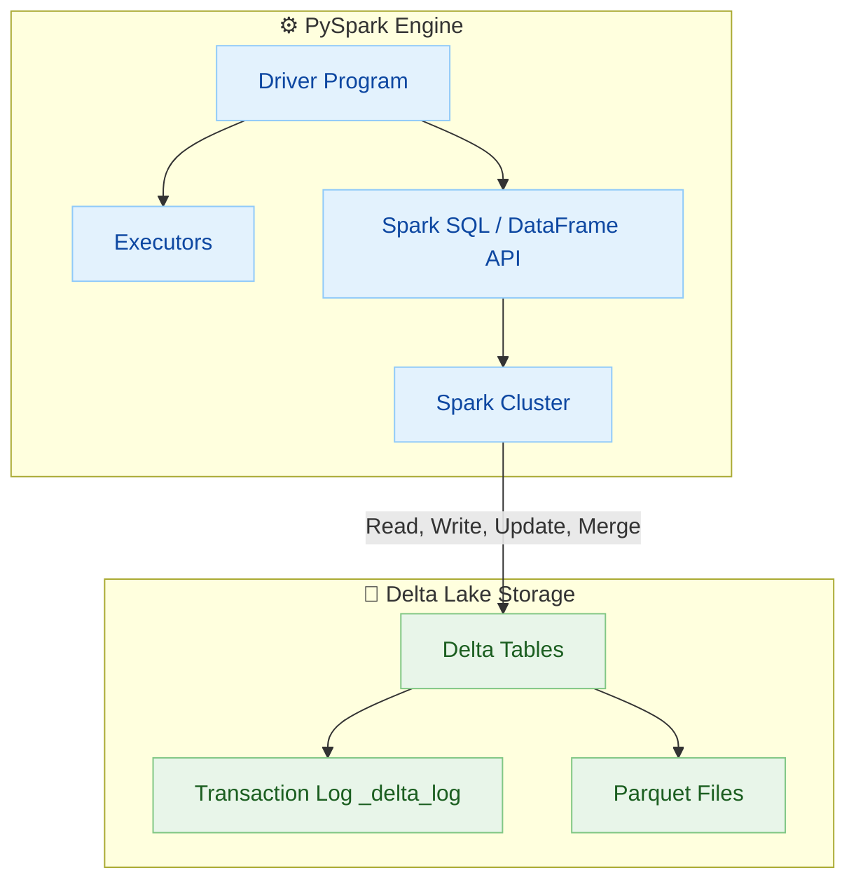

# 🏗️ Arquitetura PySpark + Delta Lake

Este diagrama mostra a arquitetura interna do PySpark Engine e sua integração com o Delta Lake Storage.

## 📋 Componentes da Arquitetura

### ⚙️ PySpark Engine
- **Driver Program**: Coordena a execução dos jobs
- **Executors**: Processam as tarefas em paralelo
- **Spark SQL / DataFrame API**: Interface de alto nível para manipulação de dados
- **Spark Cluster**: Infraestrutura distribuída de processamento

### 💾 Delta Lake Storage
- **Delta Tables**: Tabelas com suporte a ACID transactions
- **Transaction Log**: Registro de todas as operações (_delta_log)
- **Parquet Files**: Arquivos de dados otimizados para analytics

## 🔄 Fluxo de Dados
O Spark Cluster interage com o Delta Lake através de operações de:
- **Read**: Leitura de dados das Delta Tables
- **Write**: Escrita de novos dados
- **Update**: Atualização de registros existentes
- **Merge**: Operações de upsert (insert/update)